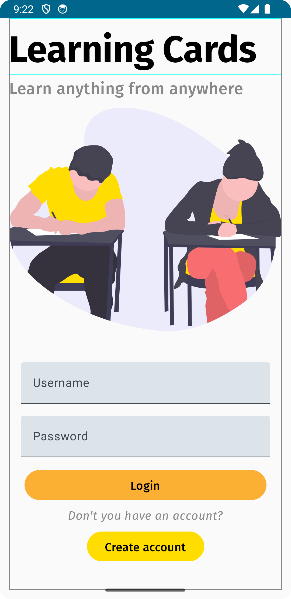

# LearningCards
My main Jetpack Compose project built by ``@nightguarder`` following Android Compose tutorials ([here](https://developer.android.com/jetpack/compose?source=post_page-----2237b74ca72a--------------------------------))

## Features
- [x] Room Database
- [ ] Unsplash API
- [x] Login/Register page
- [ ] Fetch Online data
- [ ] 

# Welcome Screen

# Login Screen

# BSD 2-Clause License
- This project is under [BSD 2-Clause License](https://opensource.org/license/bsd-2-clause/) and you are free to use this code with refence to @nightguarder.
- Please don't use this code for commercial use or other. 
